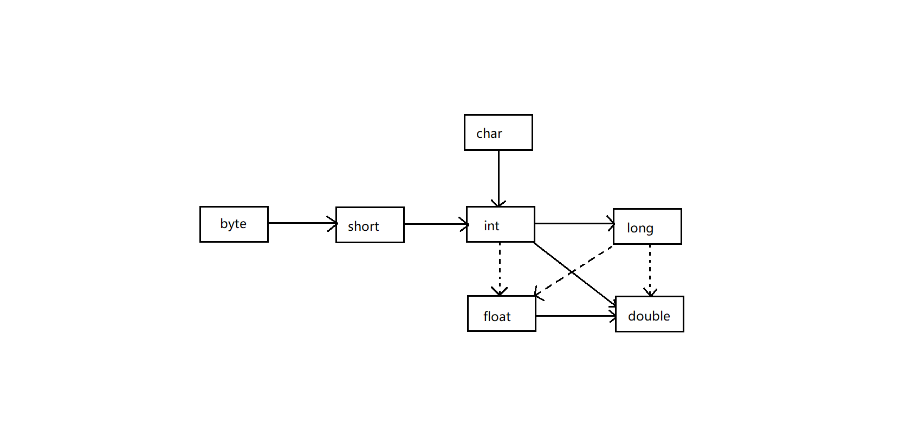

[toc]
### 1. 一个简单的JAVA应用程序
```java
public class FirstSample
{
	public static void main(String[] args)
	{
		System.out.println("hello world!");
	}
}
```
程序执行后，控制台上将会显示`hello world!`  
### 2.注释
|符号|作用|
|----|----|
|//注释内容|其注释内容从//开始到本行末尾|
|/\*注释内容\*/|可以将一段比较长的注释括起来|
|/\*\*注释内容\*/|这种注释可以用来自动生成文档|
### 3.数据类型
java数据类型分为基本数据类型和引用数据类型。
**基本数据类型有int、short、long、byte、float、double、char、boolean**，其余数据类型都为引用数据类型，**引用数据类型的默认值为null**，常见的引用数据类型有：String，StringBuffer，ArrayList，HashMap等。

#### 3.1整型
|类型|存储需求|默认值|取值范围|
|----|----|----|----|
|int|4字节|0|-2 147 483 648 ~ 2 147 483 647(正好超过20亿)|
|short|2字节|0|-32 768 ~ 32767|
|long|8字节|0|-9 223 372 036 854 775 808 ~ 9223 372 036 854 775 807|
|byte|1字节|0|-128 ~ 127|
#### 3.2浮点类型
|类型|存储需求|默认值|取值范围|
|----|----|----|----|
|float|4字节|0.0f|大约±3.402 823 47E+38F|
|double|8字节|0.0d|大约±1.797 693 134 862 315 70E+308|

浮点数值不适用于无法接受舍入误差的金融计算中，如果在数值计算中不允许有任何舍入误差，就应该使用**BigDecimal**类
#### 3.3char类型
默认值：**'\u000'**  
char类型原本用于表示单个字符。不过，现在情况已经有所变化。Unicode打破了传统字符编码机制的限制。  
我们强烈建议不要在程序中使用char类型，除非确实需要处理UTF-16代码单元。最好将**字符串**作为抽象数据处理类型。

<center><font size=4>特殊字符的转义序列</font></center>

|转义序列|名称|Unicode值|
|----|----|----|
|\b|退格|\u0008|
|\t|制表|\u0009|
|\n|换行|\u000a|
|\r|回车|\u000d|
|\"|双引号|\u0022|
|\'|单引号|\u0027|
|\\ |反斜杠|\u005c|
#### 3.4boolean类型
默认值：**false**
boolean(布尔)类型有两个值：**false**和**true**，用来判断逻辑条件。整型值和布尔值之间不能进行互相转换。
#### 3.5数据类型之间的转换
* 合法转换



实心箭头表示无信息丢失的转换，虚箭头表示可能有精度损失的转换。
* 强制转换
double有时需要将double转换为int。
	
```java
double x = 9.997;
int nx = (int) x;
//变量nx的值为9
```
### 4变量与常量
* 类变量：独立于方法之外的变量，用 static 修饰。
* 实例变量：独立于方法之外的变量，不过没有 static 修饰。
* 局部变量：类的方法中的变量。
```java
public class Variable{
    static int allClicks=0;    // 类变量
    String str="hello world";  // 实例变量
    public void mehod(){
        int i =0;  // 局部变量
    }
}
```

#### 4.1变量命名规范
变量名必须是一个以字母开头并由字母或数字构成的序列。大小写敏感。  
字母包括'A' ~ 'Z'、'a' ~ 'z'、'_'、'$'  
数字包括‘0~9’  
变量名不能是java中的保留关键字  

<center><font size=4>java中的保留关键字</font></center>
<table>
<thead>
<tr>
<th>访问控制</th>
<th>private</th>
<th>protected</th>
<th>public</th>
<th></th>
<th></th>
<th></th>
<th></th>
</tr>
</thead>
<tbody>
<tr>
<td>类，方法和变量修饰符</td>
<td>abstract</td>
<td>class</td>
<td>extends</td>
<td>final</td>
<td>implements</td>
<td>interface</td>
<td>native</td>
</tr>
<tr>
<td></td>
<td>new</td>
<td>static</td>
<td>strictfp</td>
<td>synchronized</td>
<td>transient</td>
<td>volatile</td>
<td></td>
</tr>
<tr>
<td>程序控制</td>
<td>break</td>
<td>continue</td>
<td>return</td>
<td>do</td>
<td>while</td>
<td>if</td>
<td>else</td>
</tr>
<tr>
<td></td>
<td>for</td>
<td>instanceof</td>
<td>switch</td>
<td>case</td>
<td>default</td>
<td></td>
<td></td>
</tr>
<tr>
<td>错误处理</td>
<td>try</td>
<td>catch</td>
<td>throw</td>
<td>throws</td>
<td>finally</td>
<td></td>
<td></td>
</tr>
<tr>
<td>包相关</td>
<td>import</td>
<td>package</td>
<td></td>
<td></td>
<td></td>
<td></td>
<td></td>
</tr>
<tr>
<td>基本类型</td>
<td>boolean</td>
<td>byte</td>
<td>char</td>
<td>double</td>
<td>float</td>
<td>int</td>
<td>long</td>
</tr>
<tr>
<td></td>
<td>short</td>
<td>null</td>
<td>true</td>
<td>false</td>
<td></td>
<td></td>
<td></td>
</tr>
<tr>
<td>变量引用</td>
<td>super</td>
<td>this</td>
<td>void</td>
<td></td>
<td></td>
<td></td>
<td></td>
</tr>
<tr>
<td>保留字</td>
<td>goto</td>
<td>const</td>
<td></td>
<td></td>
<td></td>
<td></td>
<td></td>
</tr>
</tbody>
</table>  

#### 4.2类变量  
* 类变量也称为静态变量，在类中以 static 关键字声明，但必须在方法之外。  
* 无论一个类创建了多少个对象，类只拥有类变量的一份拷贝。  
* 静态变量除了被声明为常量外很少使用，静态变量是指声明为 public/private，final 和 static 类型的变量。静态变量初始化后不可改变。  
* 静态变量储存在静态存储区。经常被声明为常量，很少单独使用static声明变量。  
* 静态变量在第一次被访问时创建，在程序结束时销毁。  
* 与实例变量具有相似的可见性。但为了对类的使用者可见，大多数静态变量声明为public类型。  
* 默认值和实例变量相似。数值型变量默认值是0，布尔型默认值是false，引用类型默认值是null。变量的值可以在声明的时候指定，也可以在构造方法中指定。此外，静态变量还可以在静态语句块中初始化。  
* 静态变量可以通过：ClassName.VariableName的方式访问。  
* 类变量被声明为public static final类型时，类变量名称一般建议使用大写字母。如果静态变量不是public和final类型，其命名方式与实例变量以及局部变量的命名方式一致。  
#### 4.3实例变量  
* 实例变量声明在一个类中，但在方法、构造方法和语句块之外；  
* 当一个对象被实例化之后，每个实例变量的值就跟着确定；  
* 实例变量在对象创建的时候创建，在对象被销毁的时候销毁；  
* 实例变量的值应该至少被一个方法、构造方法或者语句块引用，使得外部能够通过这些方式获取实例变量信息；  
* 实例变量可以声明在使用前或者使用后；  
* 访问修饰符可以修饰实例变量；  
* 实例变量对于类中的方法、构造方法或者语句块是可见的。一般情况下应该把实例变量设为私有。通过使用访问修饰符可以使实例变量对子类可见；  
* 实例变量具有默认值。数值型变量的默认值是0，布尔型变量的默认值是false，引用类型变量的默认值是null。变量的值可以在声明时指定，也可以在构造方法中指定；  
* 实例变量可以直接通过变量名访问。但在静态方法以及其他类中，就应该使用完全限定名：ObejectReference.VariableName。  
#### 4.4局部变量  
* 局部变量声明在方法、构造方法或者语句块中；  
* 局部变量在方法、构造方法、或者语句块被执行的时候创建，当它们执行完成后，变量将会被销毁；  
* 访问修饰符不能用于局部变量；  
* 局部变量只在声明它的方法、构造方法或者语句块中可见；  
* 局部变量是在栈上分配的。  
* 局部变量**没有默认值**，所以局部变量被声明后，必须经过初始化，才可以使用。  
#### 4.5常量  
在Java中，利用关键字final指示常量。关键字final表示这个变量只能被赋值一次。一旦被赋值以后，就不能再被更改了。习惯上，常量名使用全大写。  
在Java中，经常希望某个常量可以在一个类中的多个方法中使用，通常将这些常量称为类常量。可以使用关键字 static final 设置一个类常量，类常量定义于main方法的外部。  
### 5运算符
#### 5.1算术运算符
<table><tbody>
		<tr><th>操作符</th>
			<th>描述</th>
			<th>例子</th>
		</tr><tr><td>+</td>
			<td>加法</td>
			<td>10 + 20 等于 30</td>
		</tr><tr><td>-</td>
			<td>减法</td>
			<td>10 – 20 等于 -10</td>
		</tr><tr><td>*</td>
			<td>乘法</td>
			<td>10 * 20等于200</td>
		</tr><tr><td>/</td>
			<td>除法 (舍去余数)</td>
			<td>15 / 7等于2</td>
		</tr><tr><td>％</td>
			<td>取余(取模)</td>
			<td>15%7等于1</td>
		</tr><tr><td>++</td>
			<td>自增: 操作数的值增加1</td>
			<td>20++ 或 ++20 等于 21</td>
		</tr><tr><td>--</td>
			<td>自减: 操作数的值减少1</td>
			<td>20-- 或 --20 等于 19</td>
		</tr>
</tbody></table>  

* 整数被0除会产生一个异常，而浮点数被0除将会得到无穷大或NaN结果。  
* x++前缀形式会先完成加一，而++x后缀形式会使用变量原来的值。  
```java
int m = 7;
int n = 7;
int a = 2 * ++m;//a为16，m为8
int b = 2 * n++;//b为14，n为8
```
建议不要在表达式中使用++，不易读且易出bug。

#### 5.2位运算符
设a = 60 (0011 1100)，b = 13 (0000 1101)
<table><tbody>
		<tr><th>操作符</th>
			<th>描述</th>
			<th>例子</th>
		</tr><tr><td>＆</td>
			<td>如果相对应位都是1，则结果为1，否则为0</td>
			<td>（A＆B），得到12，即0000 1100</td>
		</tr><tr><td>|</td>
			<td>如果相对应位都是0，则结果为0，否则为1</td>
			<td>（A | B）得到61，即 0011 1101</td>
		</tr><tr><td>^</td>
			<td>如果相对应位值相同，则结果为0，否则为1</td>
			<td>（A ^ B）得到49，即 0011 0001</td>
		</tr><tr><td>〜</td>
			<td>按位取反运算符翻转操作数的每一位，即0变成1，1变成0。</td>
			<td>（〜A）得到-61，即1100 0011</td>
		</tr><tr><td>&lt;&lt;&nbsp;</td>
			<td>按位左移运算符。左操作数按位左移右操作数指定的位数。</td>
			<td>A &lt;&lt; 2得到240，即 1111 0000</td>
		</tr><tr><td>&gt;&gt;&nbsp;</td>
			<td>按位右移运算符。左操作数按位右移右操作数指定的位数。</td>
			<td>A &gt;&gt; 2得到15即 1111</td>
		</tr><tr><td>&gt;&gt;&gt;&nbsp;</td>
			<td>按位右移补零操作符。左操作数的值按右操作数指定的位数右移，移动得到的空位以零填充。</td>
			<td>A&gt;&gt;&gt;2得到15即0000 1111</td>
		</tr>
</tbody></table>

#### 5.2结合赋值和运算符
x += 4 等价于 x = x + 4  
一般的，要把运算符放在 = 号左边，如 *= 或 %=。  
#### 5.3关系运算符  
设A为10，B为20.  
<table><tbody>
		<tr><th>运算符</th>
			<th>描述</th>
			<th>例子</th>
		</tr><tr><td>==</td>
			<td>检查如果两个操作数的值是否相等，如果相等则条件为真。</td>
			<td>（A == B）为假。</td>
		</tr><tr><td>!=</td>
			<td>检查如果两个操作数的值是否相等，如果值不相等则条件为真。</td>
			<td>（A != B） 为真。</td>
		</tr><tr><td>&gt;&nbsp;</td>
			<td>检查左操作数的值是否大于右操作数的值，如果是那么条件为真。</td>
			<td>（A&gt; B）为假。</td>
		</tr><tr><td>&lt;&nbsp;</td>
			<td>检查左操作数的值是否小于右操作数的值，如果是那么条件为真。</td>
			<td>（A &lt;B）为真。</td>
		</tr><tr><td>&gt;=</td>
			<td>检查左操作数的值是否大于或等于右操作数的值，如果是那么条件为真。</td>
			<td>（A&gt; = B）为假。</td>
		</tr><tr><td>&lt;=</td>
			<td>检查左操作数的值是否小于或等于右操作数的值，如果是那么条件为真。</td>
			<td>（A &lt;= B）为真。</td>
		</tr>
</tbody></table>  

#### 5.4逻辑运算符  
设布尔值A为真，B为假  
<table><tbody>
		<tr><th>操作符</th>
			<th>描述</th>
			<th>例子</th>
		</tr><tr><td>&amp;&amp;</td>
			<td>称为逻辑与运算符。当且仅当两个操作数都为真，条件才为真。</td>
			<td>（A &amp;&amp; B）为假。</td>
		</tr><tr><td>| |</td>
			<td>称为逻辑或操作符。如果任何两个操作数任何一个为真，条件为真。</td>
			<td>（A | | B）为真。</td>
		</tr><tr><td>！</td>
			<td>称为逻辑非运算符。用来反转操作数的逻辑状态。如果条件为true，则逻辑非运算符将得到false。</td>
			<td>
			<p>!（A &amp;&amp; B）为真。</p>
			</td>
		</tr>
</tbody></table>  

#### 5.5三元运算符  
condition ? expression1:expressionw2  

如果condition为true，则返回expression1，如果condition为false，则返回expression2.  

```java
//设x=1，y=2
x < y ? x : y
//结果会返回x
```
#### 5.6运算符的优先级
<table><tbody>
		<tr><th>类别</th>
			<th>操作符</th>
			<th>优先级</th>
		</tr><tr><td>后缀</td>
			<td>() [] . (点操作符)</td>
			<td>左到右</td>
		</tr><tr><td>一元</td>
			<td>+ + - ！〜</td>
			<td>从右到左</td>
		</tr><tr><td>乘性&nbsp;</td>
			<td>* /％</td>
			<td>左到右</td>
		</tr><tr><td>加性&nbsp;</td>
			<td>+ -</td>
			<td>左到右</td>
		</tr><tr><td>移位&nbsp;</td>
			<td>&gt;&gt; &gt;&gt;&gt; &nbsp;&lt;&lt;&nbsp;</td>
			<td>左到右</td>
		</tr><tr><td>关系&nbsp;</td>
			<td>&gt;&gt; = &lt;&lt; =&nbsp;</td>
			<td>左到右</td>
		</tr><tr><td>相等&nbsp;</td>
			<td>==&nbsp; !=</td>
			<td>左到右</td>
		</tr><tr><td>按位与</td>
			<td>＆</td>
			<td>左到右</td>
		</tr><tr><td>按位异或</td>
			<td>^</td>
			<td>左到右</td>
		</tr><tr><td>按位或</td>
			<td>|</td>
			<td>左到右</td>
		</tr><tr><td>逻辑与</td>
			<td>&amp;&amp;</td>
			<td>左到右</td>
		</tr><tr><td>逻辑或</td>
			<td>| |</td>
			<td>左到右</td>
		</tr><tr><td>条件</td>
			<td>？：</td>
			<td>从右到左</td>
		</tr><tr><td>赋值</td>
			<td>= + = - = * = / =％= &gt;&gt; = &lt;&lt; =＆= ^ = | =</td>
			<td>从右到左</td>
		</tr><tr><td>逗号</td>
			<td>，</td>
			<td>左到右</td>
		</tr>
</tbody></table>

### 6字符串  
#### 6.1String类与常用方法  
```java
//创建一个简单的字符串
String a = "hello world!";
```
* 求长度(length)  
```java
String a = "hello world!";
int b = a.length();
//b为12
```
空格也算一个字符  
* 拼接( + )  
```java
String a = "hello";
String b = "world";
String c = a + b;
//c为helloworld
```
* 码点(charAt)  
```java
String a = "hello world!";
char b = a.charAt(4);
//b为o
```
charAt(4)，取索引位置4，即从左到右数第5个字符。
* 子串(substring)：  
```java
String a = "hello world!";
String b = a.substring(0,3);
//b为hel
```
substring(0,3)，取索引位置从0到2，即从左到右数第1、2、3个字符。  
* 比较(equals)  
```java
String a = "hello";
boolean b = a.equals("hello");
//b为true
```
可以用equals方法检测两个字符串是否相等。  
* 替换(replace)  
```java
String a = "hello world";
String b = a.replace("world" , "java");
//a为hello java
```
replace("旧的字符串","新的字符串")  
* 分割(split)  
```java
String a = "hello-world-!";
String[] words =  a.split("-");//此时words数组为[hello,world,!]
for (String word : words) {
	System.out.print(word);
}
//控制台输出helloworld!
```
split() 方法根据匹配给定的正则表达式来拆分字符串，返回字符串数组。  
> [更多方法参考](https://www.runoob.com/java/java-string.html)  
> [String类官方文档](https://docs.oracle.com/javase/8/docs/api/java/lang/String.html)  

#### 6.2字符串比较(==与equals)  
* **==**:基本数据类型==比较的是值，引用数据类型==比较的是内存地址。  
* **equals**:不能比较基本数据类型。  
equals() 方法存在两种使用情况：
情况 1：类没有覆盖 equals()方法。则通过 equals()比较该类的两个对象时，等价于通过“==”比较这两个对象。使用的默认是 Object类equals()方法。
情况 2：类覆盖了 equals()方法。一般，我们都覆盖 equals()方法来两个对象的内容相等；若它们的内容相等，则返回 true(即，认为这两个对象相等)。

```java
String a = new String("ab"); // a 为一个引用
String b = new String("ab"); // b为另一个引用,对象的内容一样
String aa = "ab"; // 放在常量池中
String bb = "ab"; // 从常量池中查找
if (aa == bb) // true
	System.out.println("aa==bb");
if (a == b) // false，非同一对象
	System.out.println("a==b");
if (a.equals(b)) // true
	System.out.println("aEQb");
if (42 == 42.0) { // true
	System.out.println("true");
```
String 中的 equals 方法是被重写过的，因为 Object 的 equals 方法是比较的对象的内存地址，而 String 的 equals 方法比较的是对象的值。
当创建 String 类型的对象时，虚拟机会在常量池中查找有没有已经存在的值和要创建的值相同的对象，如果有就把它赋给当前引用。如果没有就在常量池中重新创建一个 String 对象。

#### 6.3空串与null串  
* 空串是一个java对象，有自己的串长度(0)和内容(空)。  
```java
//检查一个字符串是否为空串
if(str.length() == 0)
//或
if(str.equals(""))
```
* null表示没有任何对象与该变量关联  
```java
//检查一个字符串是否为null
if(str == null)
```
有时需要检查一个字符串既不是null也不是空串  
```java
if(str !=null && str.length() != 0)
```
#### 6.4StringBuilder与StringBuffer  
String对象不可变，而StringBuilder与StringBuffer对象是可变的。  
StringBuffer线程安全，StringBuilder线程不安全。  
StringBuilder相比于StringBuffer有10%~15%的性能提升。  
> 操作少量的数据: 适用 String。  
> 单线程操作字符串缓冲区下操作大量数据: 适用 StringBuilder。  
> 多线程操作字符串缓冲区下操作大量数据: 适用 StringBuffer。  

### 7输入输出  
#### 7.1读取输入  
```java
Scanner in = new Scanner(System.in);//可以实现输入操作

System.out.println("你的名字是？");
String name = in.nextLine();//使用nextLine方法是因为在输入行中可能包含空格

System.out.println("你的年龄是？");
int age = in.nextInt();

System.out.println("你好，" + name + "，明年你" + (age + 1) +"岁。");
```
输出结果  
> 你的名字是？
> 小明
> 你的年龄是？
> 20
> 你好，小明，明年你21岁。  

#### 7.2文件输入输出
要想对文件进行读取，就需要一个用File对象构造一个Scanner对象，如下所示：
```java
Scanner in = new Scanner(Paths.get("myfile.txt"),"UTF-8");
```
如果文件名中包含反斜杠符号，就要记住在每个反斜杠之前再加一个额外的反斜杠：“c:\\mydirectory\\myfile.txt”。  
现在就可以利用任何一个Scanner方法对文件进行读取。  
要想写入文件，就需要构造一个PrintWriter对象。在构造器中，只需要提供文件名：  
```java
PrintWriter out = new PrintWriter("myfile.txt","UTF-8");
```
如果文件不存在，创建该文件。可以向输入到System.out一样使用print、println以及printf命令。  
```java
PrintWriter out = new PrintWriter("D:\\myfile.txt","UTF-8");
out.println("hello world");
out.close();

Scanner in = new Scanner(Paths.get("D:\\myfile.txt"),"UTF-8");
while (in.hasNext()){
	String str = in.nextLine();
	System.out.println(str);
}
```
### 8流程控制  
#### 8.1块作用域  
块(block)  
块(即复合语句)是指有一对大括号括起来的若干条简单的Java语句。块确定了变量的作用域。一个块可以嵌套在另一个块中。  
```java
public static void main(String[] args)
{
    int n;
    ...
    {
        int k;
        ...
    }//k的只作用域到此为止
}
```
但是，不能再嵌套的两个块中声明同名的变量。例如，下面的代码就有错误，而无法通过编译：  
```java
public static void main(String[] args)
{
    int n;
    ...
    {
        int k;
        int n;//Error--不能在这个区块中定义
        ...
    }
}
```
#### 8.2条件语句
* if条件语句  
```java
int a = 100;
if(a == 100) {
    System.out.println(a);
}
//控制台输出100
```
* if-else条件语句  
```java
int grade = 80;        // 声明，成绩为80

if(grade >= 60) {    // if判断语句判断成绩是否大于等于60
	System.out.println("及格");
} else {            // if条件不成立
	System.out.println("不及格");
}
//控制台输出及格
```
* if-else-if条件语句  
```java
int grade = 70;        // 声明，成绩为70
if (grade == 100){		//不满足条件，跳过块
	System.out.println("满分");
} else if (grade >= 80) {	//不满足条件，跳过块
	System.out.println("优秀");
} else if (grade >= 60){	//满足条件，执行块
	System.out.println("及格");
} else {            
	System.out.println("不及格");
}
//控制台输出及格
```
* switch多分支语句  
在处理多个选项时，使用if/else结构显得有些笨拙。用以使用switch语句  
```java
//建立一个包含4个选项的菜单系统
Scanner in = new Scanner(System.in);
System.out.println("请输入1、2、3、4其中一个数字");
int choice = in.nextInt();
switch (choice){
	case 1:
		...
		break;
	case 2:
		...
		break;
	case 3:
		...
		break;
	case 4:
		...
		break;
	default:
		...
		break;
}
```
switch语句将从与选项值相匹配的case标签处开始执行直到遇到break语句，或者执行到switch语句结束处为止。如果没有相匹配的case标签，而有default子句，就执行这个子句。  
case的标签可以是:  
> 类型为char、byte、short或int的常量表达式。
> 枚举常量
> 从Java SE 7开始，case标签还可以是字符串字面量。  

#### 8.3循环语句  
* while循环  

while循环语句的循环方式为利用一个条件来控制是否要继续反复执行这个语句。
```java
int count = 3;
while (count > 0)
{
	count--;
	System.out.println("剩余" + count +"次");
}
```
输出结果：  
> 剩余2次
> 剩余1次
> 剩余0次

* do-while循环  

do-while循环语句先执行一次循环体后，再判断条件是否成立。  
```java
int a = 3;
int b = 3;
while (a == 2)
{
	a--;
	System.out.println("while成功执行");
}
        
do {
	b--;
	System.out.println("do-while成功执行");
}while (b == 2);
```
输出结果：  
> do-while成功执行
> do-while成功执行  

由于while的条件不成立，所以不执行while的循环体。  
do-while先执行一次循环体，输出一次，由于b-1，满足了b==2的条件，再执行一次循环体，b再减一，不满足条件，结束。  

* for循环  

for循环语句是Java程序设计中最有用的循环语句之一。一个for循环可以用来重复执行某条语句，直到某个条件得到满足。  
```java
for(表达式1; 表达式2; 表达式3)
{
	循环体；
}
```
表达式1为初始化表达式；表达式2为循环条件判断表达式；表达式3为循环后操作表达式负责修整变量，改变循环条件。  
```java
//用for循环语句求100以内所有偶数的和。
int sum = 0;
for (int i = 1; i <= 100; i++) {
	sum += i;
}
System.out.println(sum);
//控制台输出5050
```
* for each循环

是一种增强的for循环，可以用来依次处理数组中的每个元素(其他元素的元素集合亦可)而不必为指定下标值而分心。  
```java
//遍历一个数组
int array[] = {1, 2, 3};
for (int arr : array) {
     System.out.println(arr);
}
```
#### 8.4跳转语句  
* break  

break语句刚刚在switch中已经见过了，是用来中止case的。实际上break语句在for、while、do···while循环语句中，用于强行退出当前循环。假设有两个循环嵌套使用，break用在内层循环下，则break只能跳出内层循环  
```java
for(int i=0; i<n; i++) {    // 外层循环
    for(int j=0; j<n ;j++) {    // 内层循环
        break;
    }
}
```
* continue  

continue语句只能用于for、while、do···while循环语句中，用于跳过本次循环，进行下一次循环。
* return  

return语句可以从一个方法返回，并把控制权交给调用它的语句。  

### 9数组  
数组是一种数据结构，用来存储同一类型值的集合。通过一个整型下标可以访问数组中的每一个值。  

#### 9.1数组的声明  
```java
//两种方式
int[] a;
int b[];
```
创建一个可以存储100个整数的数组并赋值：  
```java
int[] a = new int[100];
for (int i = 0; i < 100; i++) {
	a[i] = i;
}
```
这个数组的下标从0~99(不是1~100)，如果试图访问元素a\[100](或任何在0~100之外的下标)，程序就会引发"array index out of bounds"异常而终止执行。  
一旦创建了数组，就不能再改变它的大小。如果经常需要在运行过程中扩展数组的大小，就应该使用另一种数据结构——数组列表(array list)  
#### 9.2数组的初始化  
* 方式一  
```java
//分配长度为 4 个 int 型的内存空间，并分别赋初始值1，2，3，4
int[] array = new int[]{1, 2, 3, 4};
```
* 方式二  
```java
//方式一的简写
int[] array = {1, 2, 3, 4};
```
* 方式三
```java
//分配长度为 4 的内存空间，并全部赋为默认值 0
//相当于 int[] array = new int[4]{0, 0, 0, 0} 的简写
int[] array = new int[4];
```
* 数组的默认值  

|数组类型|默认初始值|
|---|---|
|byte|0|
|short|0|
|int|0|
|long|0|
|char|编码为0的字符|
|float|0.0|
|double|0.0|
|String|null|
|boolean|false|

* 数组拷贝  

```java
// 一、浅拷贝，两个变量将引用同一个数组。
int[] arrays1 = new int[]{1, 2, 3, 4};
int[] arrays2 = arrays1;
System.out.println(arrays1 == arrays2);
System.out.println(Arrays.toString(arrays1));
System.out.println(Arrays.toString(arrays2));

// 二、clone方法，深拷贝，将一个数组的所有值拷贝到一个新的数组中
int[] arrays3 = new int[]{1, 2, 3, 4};
int[] arrays4 = arrays3.clone();
System.out.println(arrays3 == arrays4);
System.out.println(Arrays.toString(arrays3));
System.out.println(Arrays.toString(arrays4));

// 三、copyOf方法，深拷贝，将一个数组的所有值拷贝到一个新的数组中
int[] arrays5 = new int[]{1, 2, 3, 4};
//第二个参数是新数组的长度，这个方法通常用来增加数组的大小
//如果新数组小于原始数组的长度，则只拷贝最前面的数据元素
int[] arrays6 = Arrays.copyOf(arrays5, arrays5.length);
System.out.println(arrays5 == arrays6);
System.out.println(Arrays.toString(arrays5));
System.out.println(Arrays.toString(arrays6));
```
#### 9.3数组的常用方法  
* 排序  

```java
static void sort(type[] a)
```
这个方法使用了优化的快速排序算法。  
* 转成字符串  

```java
static String toString(type[] a)
```
返回一个包含数组元素的字符串，这些元素被放置在括号内，并用逗号分隔，如`[2,3,5,7,11,13]`。  
* 填充  

```java
static void fill(type[] ,type v)
```
将数组的所有数据元素值设置为v。  

* 比较(equals)  

```java
static boolean equals(type[] a, type[] b)
```
如果两个数组大小相同，并且下标相同元素都对应相等，返回true。  

#### 9.4多维数组  
实质上，Java 高维数组还是一维数组，只不过这个一维数组的元素比较特殊，是由低一维的数组这种引用类型的引用构成的。  
* 方式一

```java
int[][] array = new int[3][2];
```
即创建了一个 3\*2 的二维数组，array 里有三个数组元素，三个数组元素都是长度为 2 的一维数组的引用。
* 方式二

```java
int[][] array = new int[3][];
//由于二维数组相当于是一维数组这种引用类型的引用组成的
//所以此时等价于 int[][] array = {null, null, null}
//下面可以为 array 数组分别赋上长度不同的一维数组
array[0] = new int[1];
array[1] = new int[2];
array[2] = new int[3];
```
* 方式三

```java
int[][] array = {{1, 2}, {1, 3, 5}, {2}};
```


